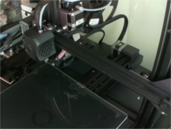

# picam-octoprint-startup

This project is a pipeline for deploying streaming on Pi Zero W with OVN5647  
On every reboot, pi will git clone down the latest update.

Files  
======  
1) picam.py - Contain code for stream server + adjust and take feed from camera  
2) rc.local - Example of the code that should be insert in rc.local  
3) startup.sh - Contain the startup command. Comment out line to prevent boot on startup/reboot  

Prerequisite  
======  
1) Git ``` sudo apt install git -y ```
2) Python3 PiCam ``` sudo apt install python3-picamera ```

Setup  
======  
1) Ensure /etc/rc.local contains code to delete git folder, git clone and startup script  
2) Run ```bash /etc/rc.local``` to test  
3) Reboot once ready  

IMPORTANT  
======  
1) For non IR camera, set the following value in /boot/config.txt  

        awb_auto_is_greyworld=1  
  
Image before setting  
  

Image after setting  
  

2) Play around with the camera settings in picam.py  
   For the git example, the following was set to reduce bright spot from direct window lighting  
   
       exposure_mode = 'snow'
  
    
